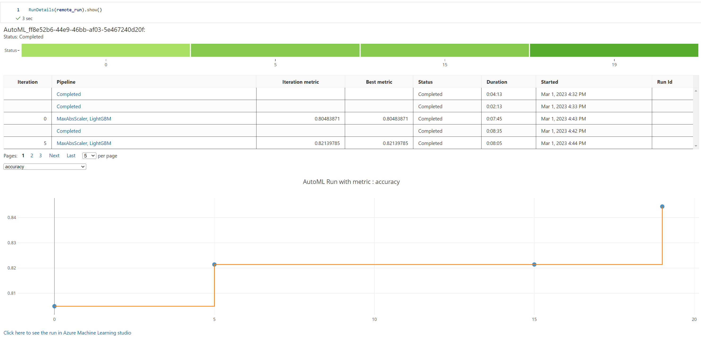
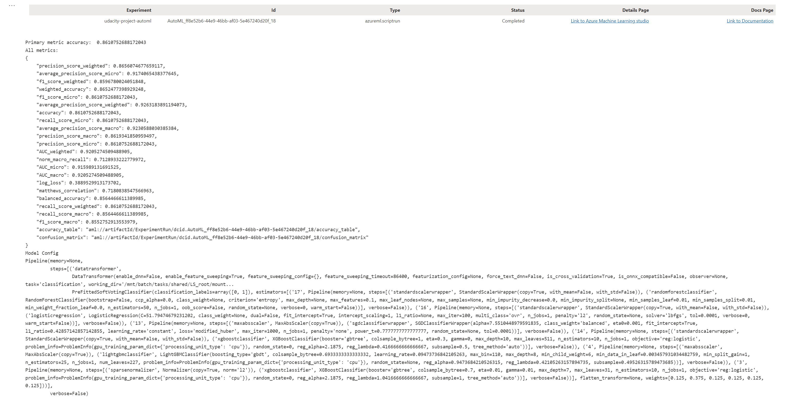
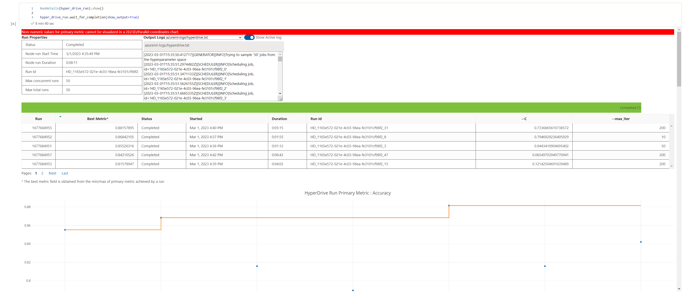
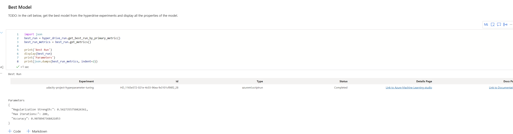
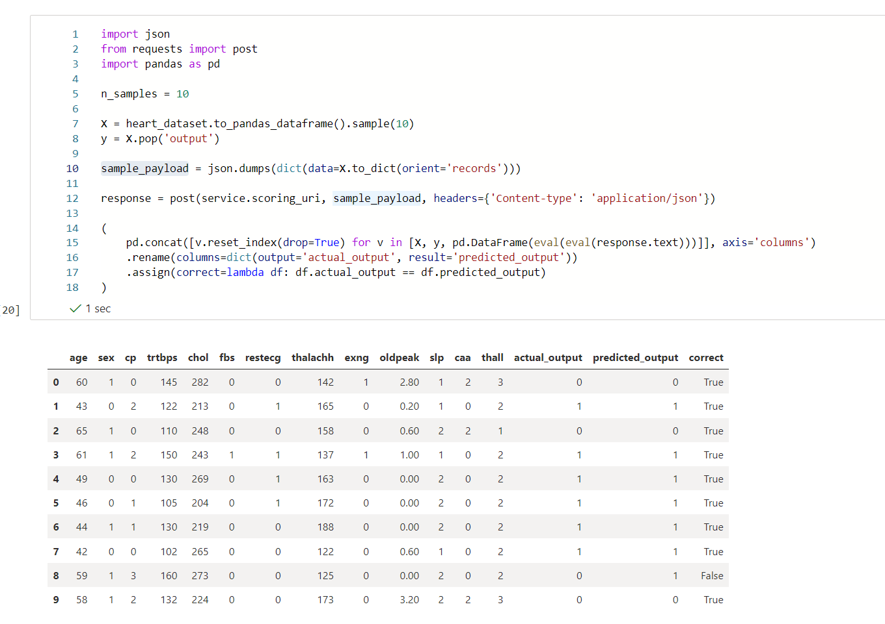

# Leveraging Azure AutoML and Hyperdrive to predict Heart Attacks

For this project I used all that I learned so far in this course to train and deploy a machine learning model on a real world dataset.
This project was about creating two models. The first model used a logistic regression which hyperparameters where optimized
using azures hyperdrive capabilities.
The second model was created using AutoML. AutoMl found that a Voting Ensemble classifier was best suited for the task. 

## Project Set Up and Installation

Please note that [compute_cluster.py](compute_cluster.py) and [train.py](train.py) are required for the notebooks to run.

## Dataset

### Overview

For this project we choose [Heart Attack Analysis Dataset](https://www.kaggle.com/datasets/rashikrahmanpritom/heart-attack-analysis-prediction-dataset) from Kaggle.
It contains 303 entries 14 columns. The columns contain general information about the persons such as age and sex but also specific medical data such as
blood pressure and cholesterol levels. The target column (output) has to values "1" means more chance of heart attack and "0" means less chance of heart attack.

All other columns are described here:
* Age : Age of the patient
* Sex : Sex of the patient
* exang: exercise induced angina (1 = yes; 0 = no)
* ca: number of major vessels (0-3)
* cp : Chest Pain type chest pain type
  * Value 1: typical angina
  * Value 2: atypical angina
  * Value 3: non-anginal pain
  * Value 4: asymptomatic
* trtbps : resting blood pressure (in mm Hg)
* chol : cholestoral in mg/dl fetched via BMI sensor
* fbs : (fasting blood sugar > 120 mg/dl) (1 = true; 0 = false)
* rest_ecg : resting electrocardiographic results
  * Value 0: normal
  * Value 1: having ST-T wave abnormality (T wave inversions and/or ST elevation or depression of > 0.05 mV)
  * Value 2: showing probable or definite left ventricular hypertrophy by Estes' criteria
* thalach : maximum heart rate achieved

### Task

The task in this project is to predict whether the chance of heart attack is high or low for a given person. For this we use above-mentioned dataset which contains
a list of medical measurements described above. 

### Access
To access the data I upload it to my GitHub repo and use the handy azure function ``TabularDatasetFactory.from_delimited_files`` where I can directly pass 
the link to the raw file. This way it works out of the box without uploading the data manually.

## Automated ML
For AutoML we used the following parameters:
* **experiment_timeout_minutes: 20** Since we use a small dataset 20 minutes should be sufficient time.
* **max_concurrent_iterations: 5** We want to use all cores on our machine so that we can train as fast as possible.
* **primary_metric: 'Accuracy'** Accuracy is an easy-to-understand metric and very suitable for classification tasks
* **task: 'classification'** Since we want to predict whether a heart attack is likely or not we choose a classification task

### Results
The AutoML model performed worst the logistic regression which is quite surprising. The accuracy was *0.87*. The model chosen was a Voting Ensemble model.  
One possible improvement would be give the training more time to run or enabled deep learning.

## Hyperparameter Tuning

We used a logistic regression model since we had a binary classification task on our hands. Logistic regression has few hyperparameters to tune. The most important one
is regularisation strength which ranges from 0 to 1. So we choose a uniform sampling method for this parameter. The other hyperparameter was max iter which defines the maximum
of iterations the logistic regression is allowed to perform during training. For this parameter we just used a series of discrete values to choose (10, 20, 50, 200).

### Results
The logistic regression performed very good with the chosen hyperparameters. It had an accuracy of *0.91* compared to *0.85* using sklearns default parameters.
For the regularisation strength the best value was *0.54* and for max iteration it was the maximum we gave the model of *200*.

We think the results is quite good as it is better than the AutoML model. Since we saw that the model picked the maximum value vor max iterations we could
give it an even larger value to choose. 

## Model Deployment
*TODO*: Give an overview of the deployed model and instructions on how to query the endpoint with a sample input.

We chose to deploy the AutoML model. We used an ``InferenceConfig`` and ``AciWebservice`` to deploy it.
Then we deployed the model using the ``Model`` class. This gave us a service object where we first checked if the endpoint is working by testing it for
the state "Healthy". We can also access the scoring_uri from the service object so that we were able to make a request to the scoring_uri.
We use the default requests module from python to make a post request with some sample data from our dataset.

## Screen Recording
https://www.youtube.com/watch?v=9kZS1KfUd7k

## Future Work
Since Hyperdrive performed very well we could use other models for classification such as SVM or Gradient Boost Models.
We did not activate authentication in this project, but in a real world model this should always be enabled for security reasons.